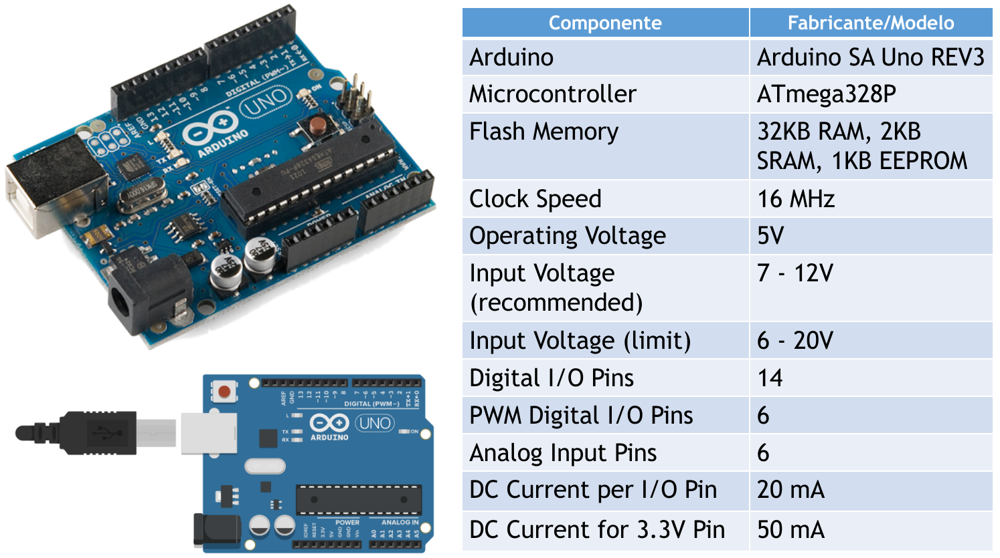
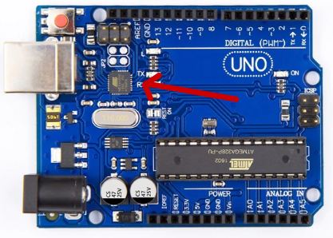
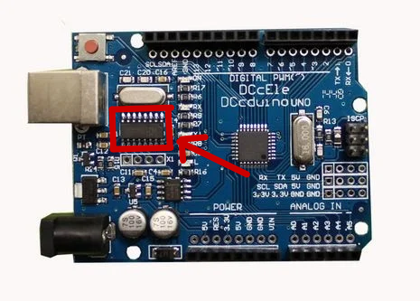

# Instalação e configuração do Arduino IDE no Linux Mint

Projeto adaptado de [Robson Vaamonde](https://github.com/vaamonde/arduino).<br>

## **Links Oficiais do Arduino IDE e Linux Mint:**

Site do Arduino: https://www.arduino.cc/<br>
Github do Arduino: https://github.com/arduino<br>
Site do Linux Mint: https://www.linuxmint.com/​<br>



Arduino é uma plataforma de prototipagem eletrônica de hardware livre e de placa única, projetada com um microcontrolador Atmel AVR com suporte de entrada/saída embutido, uma linguagem de programação padrão, a qual tem origem em Wiring, e é essencialmente C/C++. O objetivo do projeto é criar ferramentas que são acessíveis, com baixo custo, flexíveis e fáceis de se usar por principiantes e profissionais. Principalmente para aqueles que não teriam alcance aos controladores mais sofisticados e ferramentas mais complicadas.

Site Oficial do Arduino IDE: https://www.arduino.cc/<br><br>

## **Verificando se seu Arduino possui o chip CH-340**

Antes de prosseguir com a instalação, é necessário verificar se seu Arduino possui ou não o chip CH-340, e então siga o procedimento que corresponde ao modelo do seu Arduino. Abeixo é possível verificar uma foto de cada modelo. <br>

### **Arduino SEM o chip CH-340**


<br>

### **Arduino COM o chip CH-340**


<br>

## **Procedimento para Arduinos que NÃO possuem o chip CH-340**

1 - Navegue até a pasta do projeto pelo terminal e rode o comando:<br><br>
1.1 - Para a versão 1.8 do Arduino IDE:

```Bash
  bash install.sh
```

1.2 - Para a versão 2.0 do Arduino IDE:

```Bash
  bash install20.sh
```

2 - Quando solicitado, digite a senha de Super Usuário;<br>

3 - Aguardo o término da execução do script.

## **Procedimento para Arduinos que possuem o chip CH-340**

1 - Navegue até a pasta do projeto pelo terminal e rode o comando:<br><br>
1.1 - Para a versão 1.8 do Arduino IDE:

```Bash
  bash install-CH340.sh
```

1.2 - Para a versão 2.0 do Arduino IDE:

```Bash
  bash install20-CH340.sh
```

2 - Quando solicitado, digite a senha de Super Usuário;<br>

3 - Aguardo o término da execução do script.
